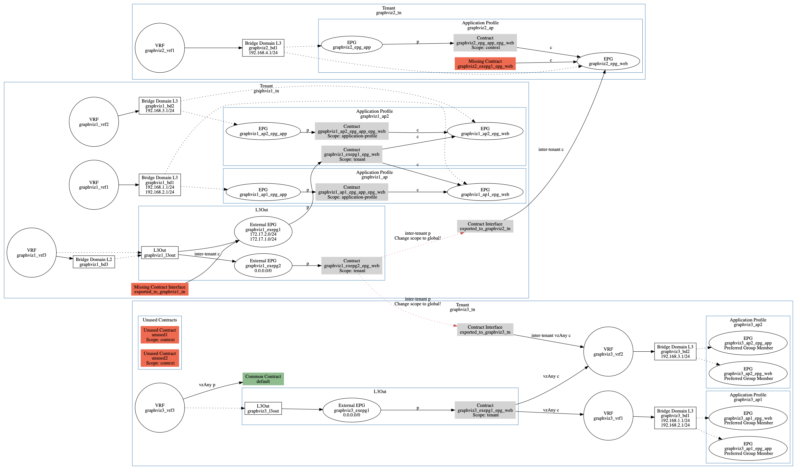

# Graphviz Cobra

Generate diagrams from running Cisco ACI Fabrics.

## Description

This tool is a Python3 script that:
- Initiates a connection to a running Cisco ACI Fabric
- Queries each Tenant
- Plots Managed Objects (Objects for short) and their associations to each other

The tool supports Password-based and Certificate-based authentication to the Cisco ACI Fabric.

## Use Cases

Diagrams produced by this tool will help to:
- Reveal object relations within the Tenant and between the Tenants
  * To simplify troubleshooting
  * And to sparkle ideas how to optimise the configuration
- Augment fabric documentation with diagrams that reflect current fabric state
- Sort out Contracts configuration:
  * Reveal unused Contracts
  * Reveal Contracts with wrongly configured Scope
  * Visually figure out required Scope for the Contract (e.g. doesn't leave AP)
- Spot unused Objects (e.g. VRFs, BDs)
- Reveal missing links between objects (e.g. L3Out to VRF or BD)

## Prerequisites

The tool depends on:
- [Cobra](https://github.com/datacenter/cobra)
- [pyGraphviz](https://github.com/pygraphviz/pygraphviz)

Make sure you have these installed before attempting to run the script.

## Usage
```
graphviz-cobra.py
              [-h]
              [-u [user]] [-p [Cisco123]]
              [-a [https://192.168.1.1]]
              [-t [example_tn1 example_tn2 ...]
              [-o OUTPUT]
              [-vv]
              [-k [user.key]]
              [-c [uni/userext/user-cisco/usercert-cisco_crt]]
```

All arguments are optional:
- APIC URL           
```
-a [https://192.168.1.1], --apic [https://192.168.1.1]
```
- APIC User for Password-based authentication
```
-u [user], --user [user]
```
- APIC Password for Password-based authentication
```                
-p [Cisco123], --password [Cisco123]
```
- Tenants to generate diagrams for. Use space to separate. Default: all Tenants.
```
-t [example_tn1 example_tn2 ...], --tenant [example_tn1 example_tn2 ...]
```
- Output file name. Default: out.png.
```
-o OUTPUT, --output OUTPUT
```
- APIC User private key file for Certificate-based authentication
```
-k [user.key], --keyfile [user.key]
```
- APIC User certificate DN for Certificate-based authentication
```
-c [uni/userext/user-cisco/usercert-cisco_crt], --certdn [uni/userext/user-cisco/usercert-cisco_crt]
```
- Verbose
```
-vv, --verbose
```

## Example Diagrams



## Supported Objects

Tenant, VRF, BD, BD Subnet, Application Profile, Application EPG, L3Out, External EPG, Standard Contracts, Contract Scopes, Contract Interfaces, vzAny, EPG Preferred Group, Tenant Common.

## ToDo

- [ ] Add Taboo Contracts

## Author

[**Vasily Prokopov**](https://github.com/vasilyprokopov)

## License

See the [LICENSE](LICENSE) file for details.

## Acronyms
